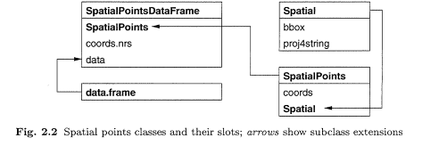
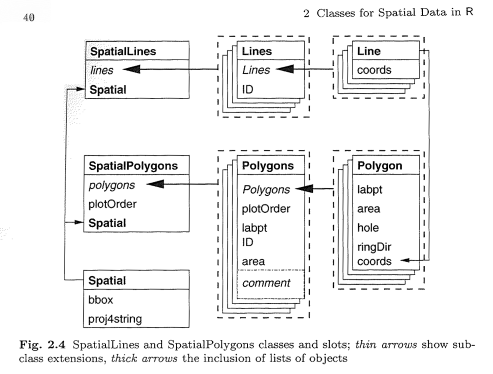

```{r setup, include=FALSE}
knitr::opts_chunk$set(echo = TRUE)
```

# 1. Présentation du package sp

## 1.1. sp: Classes and Methods for Spatial Data

Le package sp propose des structures de données pour gérer des données spatiales dans R, un peu à la manière de ce que l'on trouve dans les SIG

- des données ponctuelles, linéaires, surfaciques (= données vectorielles)
- des données matricielles (= données raster) 

C'est le principal package pour la gestion de données vectorielles ! C'est pourquoi beaucoup d'autres packages dépendent de sp (exemples: rgdal, adehabitat, biomod2, maptools). 

Pour les données raster, on utilise plus fréquemment le package ... raster (dont on parlera à la séance 2).

## 1.2. Ce que contient et ne contient pas sp

Les classes proposées par sp permettent de gérer la **partie géométrique** et la **partie attributaire** des données spatiales, ainsi que des métadonnées essentielles telles que le **système de coordonnées** employé dans les données. Il est possible de créer de toutes pièces des entités géographiques avec du code R !

En revanche, sp propose peu de fonctions pour **analyser** les données spatiales : ce sont d'autres packages dépendant de sp qui offrent cela.

Les entrées/sorties depuis ou vers des fichiers SIG (exemple: .shp, .kml, .gpx, .tif, .asc) ne sont gérées par sp. On utilise d'autres packages tel que rgdal ou maptools.

## 1.3. Interactions sp <--> raster

Le package raster est compatible avec le package sp, notamment lorsqu'il faut croiser des données vectorielles et raster.

Exemples : 

- extraire la valeur d'un raster pour N points (```raster::extract```)
- calculer la moyenne, l'écart type, etc. des pixels recouverts par un polygone (```raster::zonal```)

## 1.4. sp, rgeos, sf
Le package **rgeos** a longtemps été, en complément de sp, le seul moyen de faire certains calculs tels que : _zones tampons, intersection, calcul de longueur et de surface_. La logique de rgeos est difficile à appréhender, son efficacité n'est pas optimale.

Heureusement le package **sf** est arrivé ! Il est beaucoup plus rapide et simple d'utilisation. Mais il introduit un nouveau modèle de données différent de sf.

## 1.5. Conclusion

- Pour manipuler des données raster, les commandes de base sont dans le package **raster**
- Pour manipuler des données vectorielles, le package **sf** est simple et efficace
- Le package **sp** reste utilisé en 2018 car ses classes de données spatiales se retrouvent dans d'autres packages tierces ...

## 1.6. Livres, sites

- Bivand R., Pebesma E., Gomez-Rubio V. Applied Spatial Data Analysis 2nd ed. (bibliothèque du CEFE, et voir aussi ASDAR book (<http://www.asdar-book.org/>) 
- Lovelace R., Nowosad J., Muenchow J. Geocomputation with R (<https://geocompr.robinlovelace.net/>)


# 2. TP : les classes de données spatiales dans sp

## 2.1. Les classes Spatial*

- `SpatialPoints` : pour les données spatiales ponctuelles
- `SpatialLines` : pour les données spatiales linéaires
- `SpatialPolygons` : pour les données spatiales surfaciques
- `SpatialPixels` et `SpatialGrid` : pour les données spatiales matricielles ou raster (sur une grille)

## 2.2. Créer un objet SpatialPoints à partir d'une matrice de coordonnées GPS

Définissons un `data.frame` avec 5 lignes et 4 colonnes. Les vecteurs `lon` and `lat` donnent la position GPS des 5 lieux, en degrés décimaux (système de coordonnées WGS84)

```{r 6 lieux dans un data.frame}
fid <- c(1, 2, 3, 4, 5, 6)
name <- c("Agropolis","Bois de Montmaur","CEFE",
          "Station météo TE","FDS Bâtiment 4","Statue Peyrou")
lon <- c(3.86921, 3.86898, 3.86450, 3.86306, 3.86282, 3.87093)
lat <- c(43.64541, 43.64266, 43.63881, 43.63885, 43.63464, 43.61165)
coul <- c("red", "green", "red", "red", "red", "green")
df <- data.frame(name, lon, lat, coul)
```


## 2.3. La classe SpatialPoints

La classe `SpatialPoints` est une structure de données pour stocker des points : seulement la partie "spatiale", pas la partie "attributs".

Pour construire un objet de type `SpatialPoints`, nous avons besoin de :

- une matrice à 2 colonnes (avec des coordonnées X Y, ou "longitude latitude")
- si possible, un objet CRS généré avec la **définition proj 4** du système de coordonnées. Ici la définition vient du site epsg.io : <http://epsg.io/4326>.


```{r Creer un SpatialPoints}
library(sp)
matcoords <- as.matrix(df[,c("lon","lat")])
sp_pts <- SpatialPoints(matcoords, proj4string = CRS("+proj=longlat +datum=WGS84 +no_defs"))
# cette definition proj4stringavec le code EPSG ID est equivalente à la definition complète ...
sp_pts <- SpatialPoints(matcoords, proj4string = CRS("+init=EPSG:4326"))
slotNames(sp_pts)
```

## 2.4. Les classes Spatial*DataFrame

- `SpatialPointsDataFrame` : pour les données spatiales ponctuelles et leurs attributs
- `SpatialLinesDataFrame` : pour les données spatiales linéaires et leurs attributs
- `SpatialPolygonsDataFrame` : pour les données spatiales surfaciques et leurs attributs
- `SpatialPixelsDataFrame` et `SpatialGridDataFrame` : pour des données spatiales matricielles ou raster accompagnées de leur(s) valeur(s)


## 2.5. Créer un 'SpatialPointDataFrame' à partir d'un 'data.frame' muni de coordonnées
Utiliser la fonction coordinates pour créer l'objet, en désignant les 2 colonnes qui contiennent les coordonnées géographiques.
```{r Creer un SpatialPointsDataFrame}
# copier le data.frame
sp_pts_df <- df
# transformer un data.frame en SpatialPointsDataFrame
coordinates(sp_pts_df) <- c("lon","lat")
sp_pts_df
# ceci fonctionne aussi :
sp_pts_df <- df
coordinates(sp_pts_df) <- ~lon+lat
# definir le CRS (optionnel)
proj4string(sp_pts_df) <- CRS("+init=EPSG:4326")
slotNames(sp_pts_df)
```

## 2.6. Relation d'héritage entre les classes Spatial\*, SpatialPoints\* et SpatialPointsDataFrame

Le schema suivant tiré du "ASDAR Book" (<http://www.asdar-book.org/>), p.35 nous montre la composition de la class SpatialPoints.



***

La classe S4 `SpatialPoints` hérite de la classe `Spatial` et l'étend

```{r Classe SpatialPoints}
showClass("SpatialPoints")
```

***

La classe S4 `Spatial` est la plus générique. Elle a 2 "slots" : bbox (matrix) et proj4string (CRS)

```{r Classe Spatial}
showClass("Spatial")
```

## 2.7. SpatialLines et SpatialPolygons 

### Créer des objets SpatialLines et SpatialLinesDataFrame avec R.
Le schema suivant tiré du "ASDAR Book" (<http://www.asdar-book.org/>), p.40 nous montre la composition de la class SpatialPolygons et SpatialLines



Un objet **SpatialLines** est composé d'une **liste de Lines**.
Un objet **Lines** est une **liste of Line**.
Un objet **Line** est une matrice **matrice de coordonnées** à 2 colonnes, qui représente un ensemble ordonné de points.

**Lines** = équivalent d'une *Polyligne* dans un Shapefile = *MULTILINESTRING* en notation WKT : <https://en.wikipedia.org/wiki/Well-known_text#Geometric_objects>)

## 2.8. Exemple : créer 2 polylignes formées de points aléatoires (ensembles de 7 et 5 points)

```{r SpatialLines p1}
# build 2 Lines object with ID slot = L1 and L2
x1 <- runif(7, -0.005, 0.005) + 3.87
y1 <- runif(7, -0.005, 0.005) + 43.65
x2 <- runif(5, -0.005, 0.005) + 3.86
y2 <- runif(5, -0.005, 0.005) + 43.61
matcoords1 <- cbind(x1, y1)
matcoords2 <- cbind(x2, y2)
line_1 <- Line(matcoords1)
line_2 <- Line(matcoords2)
lines_1 <- Lines(list(line_1), "L1") # L1 est l'identifiant de la polyligne (obligatoire)
lines_2 <- Lines(list(line_2), "L2") # L2 est l'identifiant
```

## 2.11. Exemple (2/3) : SpatialLines
```{r SpatialLines p2}
sp_lines <- SpatialLines(list(lines_1, lines_2))
str(sp_lines)
```

## 2.12. Exemple (3/3) : SpatialLinesDataFrame
Un objet **SpatialLines** résulte de la combinaison entre un **SpatialLines** et un **data.frame**.
Utiliser le slot **ID** du SpatialLines et le nom des lignes (**row.names**) du data.frame pour les mettre en correspondance.
```{r SpatialLines p3}
# créons la table attributaire (data.frame, 2 colonnes, et ID comme .
NAME=c("RANDOM1", "RANDOM2")
LENGTH_M = SpatialLinesLengths(sp_lines, longlat=T) * 1000
df_demo <- data.frame(NAME, LENGTH_M)
row.names(df_demo) <- c("L1","L2")
sp_lines_df <- SpatialLinesDataFrame(sp_lines, df_demo)
sp_lines_df@data
```

# TP. Lecture / écriture shapefile

## Lire / écrire des shapefiles
2 packages sont utilisables

* **rgdal** avec les les fonctions readOGR et writeOGR
* **maptools** avec les fonctions readShapePoints, readShapeLines, readShapePoly, writeShapePoints, writeShapeLines, writeShapePoly 

**rgdal** peut aussi lire les formats ESRI File GDB, PostGIS, MapInfo, GRASS ...

### Paramètres de readOGR / writeOGR pour les shapefiles :
- dsn = répertoire du .shp
- layer = nom du .shp **sans l'extension**
- driver (pour writeOGR) = "ESRI Shapefile"
- p4s (optionnel) = définition système coordonnées 
- overwrite_layer = FALSE / TRUE 
- encoding

Remarque : pour la lecture / écriture de données volumineuses, le package sf est nettement plus performant !

## Lire un shapefile avec rgdal::readOGR
```{r readOGR exemple}
library(rgdal)
setwd("D:/GitRepo/RSpatial/formation_2018")
shp_communes  <- readOGR(dsn="data/Montpellier_OpenData/Communes",
                         layer="MMM_MMM_Limites")
#shp_communes
shp_communes@data
plot(shp_communes)
```

## Ecrire un shapefile avec rgdal::writeOGR
L'objet à écrire doit être un Spatial*DataFrame
```{r writeOGR exemple}
writeOGR(sp_lines_df, dsn="data/output", layer="test_lines", 
         driver="ESRI Shapefile", 
         overwrite_layer=TRUE)
writeOGR(sp_pts_df, dsn="data/output", layer="test_points", 
         driver="ESRI Shapefile", 
         overwrite_layer=TRUE)
```

## Comment convertir des données spatiales d'un système de coordonnées vers un autre ?
Transforming coordinates from a system to another require the `rgdal` package. `rgdal` provides drivers for an important number of raster and vector formats (see all the formats on the website of the GDAL library and its OGR sub-library). It also provides the **spTransform** function that makes possible to transform coordinates. 
It is possible to apply the **spTransform** on any `Spatial*` or `Spatial*DataFrame` class. The system coordinates of the input object must have been defined with **proj4string** parameter. When calling **spTransform** we only have to specify output coordinate system.

```{r transform CRS WGS84 > L93}
# check input CRS
proj4string(sp_pts_df)
# transformation to RGF93 / Lambert93
sp_pts_df_l93 <- spTransform(sp_pts_df, CRS("+init=EPSG:2154"))
sp_pts_df_l93@coords
```


# TP. Visualiser les données sur une carte
Pour en savoir plus : Bivand, ASDAR Book, chap. 3

## plot
```{r plot(SpatialPoints)}
plot(sp_lines_df, col="red")
plot(sp_pts_df, col="blue",add=TRUE)
```

## leaflet
Avec le package `leaflet`, visualisez facilement vos données sur des cartes web interactives.
Leaflet est utilisable avec **Shiny** et **RPubs**.
```{r leaflet exemple 1}
library(leaflet)
# cliquer sur les marqueurs pour afficher les popups !
leaflet() %>%
  addTiles() %>%
  addMarkers(data=sp_pts_df, popup=name)
```

## leaflet, exemple 2
```{r leaflet exemple 2}
leaflet() %>%
  addTiles() %>%
  addPolylines(data=sp_lines_df, label=paste(NAME,"=",LENGTH_M,"m.")) %>%
  addCircleMarkers(data=sp_pts_df, color=coul)
```

## tmap
```{r tmap}
library(tmap)
tm_shape(sp_pts_df) +
  tm_symbols(col=coul, text=name) 

tm_shape(shp_communes) +
  tm_polygons() +
tm_shape(sp_pts_df) +
  tm_symbols(size=0.4, col=sp_pts_df$coul, shape=3) 
```


# COMMENT FAIRE POUR ...

## Comment lire des coordonnées en degrés minutes secondes ?
char2dms convertit une chaîne en objet DMS. La chaîne doit se terminer par N,S,W ou E. Préciser le caractère utilisé pour les degrés, les minutes, les secondes (par défaut : d,',"). as.numeric convertit l'objet DMS en degrés décimaux.

```{r DMS 2 DD}
villes <- c("Paris", "Madrid", "Buenos-Aires", "New-York")
char_lat <- c("48°51' 24\" N", "40°26'00\"N", "34°36'29\"S", "40°42' 52\"N")
char_lon <- c("2°21'07\"E", "3°41' W", "58°22' 13\" W", "74°0'22\"W")
dd_lat <- as.numeric(char2dms(char_lat, "°", "'", "\""))
dd_lon <- as.numeric(char2dms(char_lon, "°", "'", "\""))
leaflet() %>% addTiles() %>% addMarkers(lng=dd_lon, lat=dd_lat)
```

## Comment calculer une matrice de distance entre des points ?
spDists calcule les distances entre 2 ensembles de points.

Si les coordonnées des points sont dans un système métrique (exemple UTM), alors utiliser longlat=FALSE pour obtenir la distance euclidienne en mètres.

Si les coordonnées des points sont en degrés (exemple WGS84), alors utiliser longlat=TRUE. On obtient une distance en km.

```{r Geodesic dist}
# distance entre Madrid, Buenos Aires, Paris, New-York (cf exemple précédent)
sp_pts_villes <- data.frame(villes, dd_lat, dd_lon, char_lat, char_lon)
coordinates(sp_pts_villes) <- c("dd_lon","dd_lat")
proj4string(sp_pts_villes) <- CRS("+init=EPSG:4326")

# matrice de distance : toutes les combinaisons 
m <- spDists(sp_pts_villes, longlat=TRUE)
dimnames(m) <- list (c("PAR","MAD","BAI","NYC"), c("PAR","MAD","BAI","NYC"))
m
# distances consécutives
v <- spDists(sp_pts_villes, longlat=TRUE, segments=TRUE)
names(v) <- c("PAR-MAD","MAD-BAI", "BAI-NYC")
v
```

## Comment sélectionner les points qui intersectent un polygone ?


## Comment enregistrer vos données en KML pour les visualiser dans Google Earth ?


## Comment visualiser vos données sur un fond de carte OpenStreetMap avec Leaflet ?


## Divers - Exercice
jointures
restaurant bar : densité de bars X grille
arret de tramway situé à castelnau le lez
arbres remarquables X parcs et jardin
iris : choroplethe
transformation WGS84 > L93
