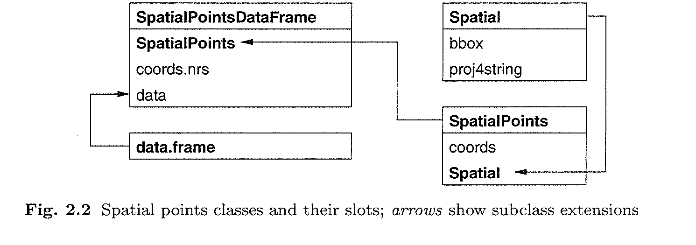
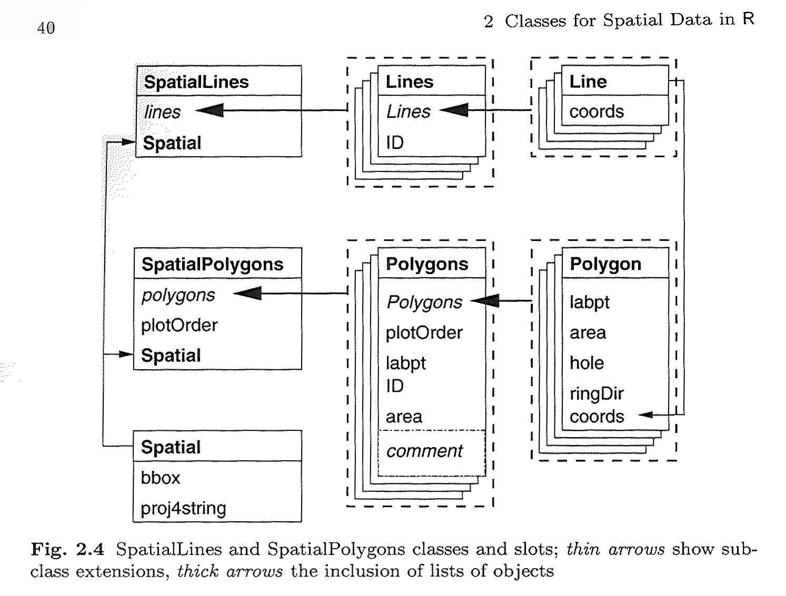

```{r setup, include=FALSE}
knitr::opts_chunk$set(echo = TRUE)
```

# 1. Présentation du package sp

## 1.1. sp: Classes and Methods for Spatial Data

Le package sp propose des structures de données pour gérer des données spatiales dans R, un peu à la manière de ce que l'on trouve dans les SIG

- des données ponctuelles, linéaires, surfaciques (= données vectorielles)
- des données matricielles (= données raster) 

C'est le principal package pour la gestion de données vectorielles ! C'est pourquoi beaucoup d'autres packages dépendent de sp (exemples: rgdal, adehabitat, biomod2, maptools). 

Pour les données raster, on utilise plus fréquemment le package ... raster (dont on parlera à la séance 2).

## 1.2. Ce que contient et ne contient pas sp

Les classes proposées par sp permettent de gérer la **partie géométrique** et la **partie attributaire** des données spatiales, ainsi que des métadonnées essentielles telles que le **système de coordonnées** employé dans les données. Il est possible de créer de toutes pièces des entités géographiques avec du code R !

En revanche, sp propose peu de fonctions pour **analyser** les données spatiales : ce sont d'autres packages dépendant de sp qui offrent cela.

Les entrées/sorties depuis ou vers des fichiers SIG (exemple: .shp, .kml, .gpx, .tif, .asc) ne sont gérées par sp. On utilise d'autres packages tel que rgdal ou maptools.

## 1.3. Interactions sp <--> raster

Le package raster est compatible avec le package sp, notamment lorsqu'il faut croiser des données vectorielles et raster.

Exemples : 

- extraire la valeur d'un raster pour N points (```raster::extract```)
- calculer la moyenne, l'écrat type, etc. des pixels recouverts par un polygone (```raster::zonal```)

## 1.4. sp, rgeos, sf
Le package **rgeos** a longtemps été, en complément de sp, le seul moyen de faire certains calculs tels que : _zones tampons, intersection, calcul de longueur et de surface_. La logique de rgeos est difficile à appréhender, son efficacité n'est pas optimale.

Heureusement le package **sf** est arrivé ! Il est beaucoup plus rapide et simple d'utilisation. Mais il introduit un nouveau modèle de données différent de sf.

## 1.5. Conclusion

- Pour manipuler des données raster, les commandes de base sont dans le package **raster**
- Pour manipuler des données vectorielles, le package **sf** est simple et efficace
- Le package **sp** reste incontournable car ses classes de données spatiales se retrouvent dans d'autres packages tierces ...

## 1.6. Livres, sites

- ASDAR book (<http://www.asdar-book.org/>) à emprunter ou consulter à la bibliothèque du CEFE
- Geocomputation with R (<https://bookdown.org/robinlovelace/geocompr/>)


# 2. COURS : les classes de données spatiales dans sp

## 2.1. Les classes Spatial*

- SpatialPoints : pour les données spatiales ponctuelles
- SpatialLines : pour les données spatiales linéaires
- SpatialPolygons : pour les données spatiales surfaciques
- SpatialPixels et SpatialGrid : pour les données spatiales matricielles ou raster (sur une grille)

## 2.2. Créer un objet SpatialPoints à partir d'une matrice de coordonnées GPS

Définissons un `data.frame` object with 5 rows and 4 columns. The numeric vector lon and lat give the GPS coordinates of 5 points, in decimal degrees (WGS84) .

```{r}
library(sp)
name <- c("Agropolis","Bois de Montmaur","CEFE","Station météo TE","FDS Bâtiment 4","Statue Peyrou")
lon <- c(3.86921,3.86898,3.86450,3.86306,3.86282,3.87093)
lat <- c(43.64541,43.64266,43.63881,43.63885,43.63464,43.61165)
color <- c("blue","green","blue","blue","blue","green")
df <- data.frame(name, lon, lat, color)
```


## 2.3. La classe SpatialPoints

La classe SpatialPoints est une structure de données pour stocker des points : seulement la partie "spatiale", pas la partie "attributs".
Pour construire un objet SpatialPoints, nous avons besoin de :

- une matrice à 2 colonnes (avec des coordonnées X Y, ou "longitude latitude")
- si possible, un objet CRS généré avec la **définition proj 4** du système de coordonnées. Ici la définition vient du site epsg.io : <http://epsg.io/4326>.

```{r}
matcoords <- as.matrix(df[,c("lon","lat")])
spts <- SpatialPoints(matcoords, proj4string = CRS("+proj=longlat +datum=WGS84 +no_defs"))
# the following proj4string definition with EPSG ID is equivalent to the explicit definition ...
spts <- SpatialPoints(matcoords, proj4string = CRS("+init=EPSG:4326"))
slotNames(spts)
```


## 2.4. Relation d'héritage entre la classe Spatial et SpatialPoints

La classe S4 ```SpatialPoints``` hérite de la classe ```Spatial``` et l'étend

```{r}
library(sp)
getClass("SpatialPoints")
```

## 2.5. La classe Spatial

La classe S4 ```Spatial``` est la plus générique. Elle a 2 "slots" : bbox (matrix) et proj4string (CRS)

```{r}
getClass("Spatial")
```

## 2.6. Les classes Spatial*DataFrame

- SpatialPointsDataFrame : pour les données spatiales ponctuelles et leurs attributs
- SpatialLinesDataFrame : pour les données spatiales linéaires et leurs attributs
- SpatialPolygonsDataFrame : pour les données spatiales surfaciques et leurs attributs
- SpatialPixelsDataFrame et SpatialGridDataFrame : pour des données spatiales matricielles ou raster accompagnées de leur(s) valeur(s)


## 2.7. Building a SpatialPointDataFrame from a data.frame with coordinates
It can be achieved with coordinates method with the name of X and Y columns.
```{r}
spts_df <- df
# turn a data.frame into a SpatialPointsDataFrame by providing X Y columns
coordinates(spts_df) <- c("lon","lat") 
# ceci fonctionne aussi :
spts_df <- df
coordinates(spts_df) <- ~lon+lat
# define the CRS (optional)
proj4string(spts_df) <- CRS("+init=EPSG:4326")
slotNames(spts_df)
```

## 2.8. Relation d'héritage entre les classes Spatial*, SpatialPoints* et SpatialPointsDataFrame

Le schema suivant tiré du "ASDAR Book" (<http://www.asdar-book.org/>), p.35 nous montre la composition de la class SpatialPoints.



```{r}
library(sp)
getClass("SpatialPoints")
```


## 2.9. SpatialLines et SpatialPolygons 
Relier les points ! Créer les objets SpatialLines et SpatialLinesDataFrame avec R.
Le schema suivant tiré du "ASDAR Book" (<http://www.asdar-book.org/>), p.40 nous montre la composition de la class SpatialPolygons et SpatialLines



A **SpatialLines** object can be made from a **list of Lines** objects.
A **Lines** object is a **list of Line** objects .
A **Line object** is made of a **matrix of coordinates**, just as a set of ordered points.

**Lines** in R is like a *Polyline* feature in a Shapefile, or a *MULTILINESTRING* feature in WKT notation : <https://en.wikipedia.org/wiki/Well-known_text#Geometric_objects>)

```{r}
# build 2 Lines object with ID slot = L1 and L2
matcoords1 <- as.matrix(df[,c("lon","lat")])
matcoords2 <- cbind(runif(5, -0.001, 0.001) + 3.8676, runif(5, -0.001, 0.001) + 43.6423)
line_1 <- Line(matcoords1)
line_2 <- Line(matcoords2)
lines_1 <- Lines(list(line_1), "L1")
lines_2 <- Lines(list(line_2), "L2")
splines <- SpatialLines(list(lines_1, lines_2))
str(splines)
```

A **SpatialLinesDataFrame** object is the combination between a **SpatialLines** object and a **data.frame**.
Use the **ID slot** from the SpatialLines object and the **row names** from the data.frame to make them match.

```{r}
# build a data.frame object with 2 columns and ID as the rows names.
NAME=c("LINE1", "RANDOM2")
LENGTH_M = SpatialLinesLengths(splines, longlat=T) * 1000
df_demo <- data.frame(NAME, LENGTH_M)
row.names(df_demo) <- c("L1","L2")
splines_df <- SpatialLinesDataFrame(splines, df_demo)
## save the SpatialLinesDataFrame as a shapefile
#writeLinesShape(splines_df, fn="some_lines")
```

## Lire un shapefile avec rgdal

## Ecrire un shapefile avec rgdal


# COMMENT FAIRE POUR ...

## Comment lire des coordonnées en degrés minutes secondes ?

## Comment calculer une matrice de distance entre des points ?

## Comment convertir des données spatiales d'un système de coordonnées vers un autre ?

Transforming coordinates from a system to another require the `rgdal` package. `rgdal` provides drivers for an important number of raster and vector formats (see all the formats on the website of the GDAL library and its OGR sub-library). It also provides the **spTransform** function that makes possible to transform coordinates. 
It is possible to apply the **spTransform** on any `Spatial*` or `Spatial*DataFrame` class. The system coordinates of the input object must have been defined with **proj4string** parameter. When calling **spTransform** we only have to specify output coordinate system.

```{r}
# check input CRS
proj4string(spts_df)
# transformation to RGF93 / Lambert93
spts_df_l93 <- spTransform(spts_df, CRS("+init=EPSG:2154"))
spts_df_l93@coords
```

## Comment sélectionner les points qui intersectent un polygone ?

## Comment enregistrer vos données en KML pour les visualiser dans Google Earth ?

## Comment visualiser vos données sur un fond de carte OpenStreetMap avec Leaflet ?


# DONNEES

https://data.montpellier3m.fr/dataset/contours-des-communes-de-montpellier-mediterranee-metropole
https://data.montpellier3m.fr/dataset/stations-velomagg-de-montpellier-mediterranee-metropole
https://data.montpellier3m.fr/dataset/arrets-de-bus-de-montpellier-mediterranee-metropole
https://data.montpellier3m.fr/dataset/arrets-de-tramway-de-montpellier-mediterranee-metropole
https://data.montpellier3m.fr/dataset/reseau-de-tramway-de-montpellier-mediterranee-metropole
https://data.montpellier3m.fr/dataset/population-2008-carroyage-insee-sur-montpellier-mediterranee-metropole
https://data.montpellier3m.fr/dataset/reseau-de-bus-lignes-suburbaines-de-montpellier-mediterranee-metropole
https://data.montpellier3m.fr/dataset/reseau-de-bus-lignes-urbaines-de-montpellier-mediterranee-metropole
https://data.montpellier3m.fr/dataset/parcs-et-jardins-de-montpellier-mediterranee-metropole
http://data.montpellier3m.fr/dataset/parcs-et-jardins-surface-de-montpellier
https://data.montpellier3m.fr/dataset/arbres-remarquables-de-montpellier
https://data.montpellier3m.fr/dataset/iris
https://data.montpellier3m.fr/dataset/restaurants-bars-et-cafes-de-montpellier-mediterranee-metropole
https://data.montpellier3m.fr/dataset/synth%C3%A8se-des-voies-en-mode-doux-de-montpellier


# Exercice
jointures
restaurant bar : densité de bars X grille
arret de tramway situé à castelnau le lez
arbres remarquables X parcs et jardin

iris : choroplethe

transformation WGS84 > L93


