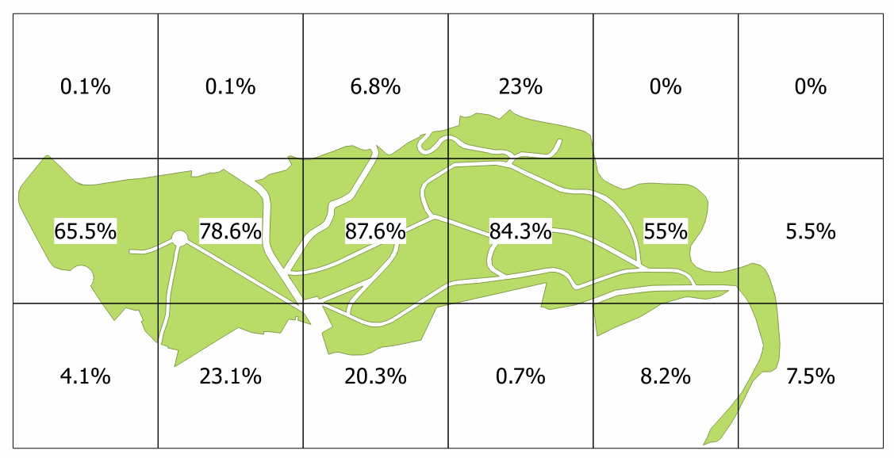

```{r setup, include=FALSE}
knitr::opts_chunk$set(echo = TRUE)
```

# PART 1. Distances

## Input data 

In this 1st example we will use 2 shapefiles as input data :

- **Arbres_align.shp** is a Point shapefile with 553 features. `IDARBRE` column contains unique ID. 
- **Parc_Jardin.shp** is a Polygon shapefile with 12 features. `OBJECTID` column contains unique ID.

All the shapefiles are in the RGF93 / Lambert93 coordinate system (EPSG ID = 2154).

```{r message=FALSE}
setwd("D:/bacasable/Rmeeting")
URL <- "http://cartotheque.cefe.cnrs.fr/wp-content/uploads/2016/06/Rmeeting.zip"
download.file(URL,"Rmeeting.zip")
unzip("Rmeeting.zip")

library(sp)
library(rgdal)
library(rgeos)
library(maptools)
```

```{r}
shp_origin <- readOGR(".","Arbres_align")
shp_target <- readOGR(".","Parc_Jardin")
# show unique IDs from IDARBRE & OBJECTID columns 
head(shp_origin$IDARBRE)
head(shp_target$OBJECTID)
```

## The gDistance function : distance matrix between points and polygons

The **gDistance** function with 2 Spatial\* objects will return a distance matrix between all features, in meters. Input objects have to be in a metric coordinate system, adn **byid** parameter must be set to TRUE to consider each feature individually.

```{r}
# gDistance will return a 553 x 12 matrix
# (553 points from shp_origin, 12 polygons from shp_target)
dist_mat <- gDistance(shp_target, shp_origin, byid=TRUE)
dim(dist_mat)
```

**Note :** if we were working with just 1 layer (to find the closest polygon from the same layer), we would call the gDistance function with just 1 SpatialPolygonsDataFrame. The resulting matrix would have a 0 meter diagonal (distance between each polygon and itself) that we would replace by NA value to find the minimun distance ...

```{r}
dist_mat_self <- gDistance(shp_target, byid=TRUE)
is.na(dist_mat_self) <- (dist_mat_self==0)
```

## HOWTO find the closest polygons from each points, and its distance 

Now we have 553 x 12 matrix with distances. For each 553 points, we want to find the closest polygon. 

```{r}
# for each point, find indice of the minimum distance
ind_min <- apply(dist_mat, MARGIN = 1, which.min)
# unique ID of starting point
FROMID <- shp_origin$IDARBRE 
# unique ID of closest polygon
TOID <- shp_target$OBJECTID
NEARID <- TOID[ind_min]
# get minimum distance
# mi will be an indices matrix to find the distance to the nearest target
# with 1: row indices(sequence from 1 to N)  and 2:col indices(from which.min) 
mi <- cbind(i=seq.int(length(ind_min)), ind_min)
NEARDIST <- dist_mat[mi]
```

We put the result in a new data.frame with 3 columns : FROMID, NEARID, NEARDIST. Then, we join these columns to the original Point shapefile and we save it in a new shapefile.

```{r}
df_result <- data.frame(FROMID, NEARID, NEARDIST, row.names = row.names(shp_origin))

shp_result <- spCbind(shp_origin, df_result)
writeOGR(shp_result,".","result_dist2",driver="ESRI Shapefile")
```

# PART 2. Intersection

## Input data

We have two polygon layers : the first layer (`Parc_Jardin.shp`) contain woods, the second layer (`grid_500m.shp`) is a grid. 

```{r}
# intersection between grid polygons & data polygons (Parc_Jardin)
shp_data <- readOGR(".","Parc_Jardin")
shp_grid <- readOGR(".", "grid_500m")
names(shp_data@data)
names(shp_grid@data)
plot(shp_grid)
plot(shp_data, add=T)
```

We want to know the total area of woods by grid cell. This can be achieved with 3 steps.

1. Intersecting `shp_data` with `shp_grid` into `result`
2. Calculate area of the geometries from `result`
3. Aggregating `result` by grid cell unique ID

## The gIntersection function : intersecting two polygon layers

```{r}
# tip for optimization : keep only grid cells that intersects data 
shp_grid_over_data <- shp_grid[shp_data,]

# then, intersect !
result <- gIntersection(shp_data, shp_grid_over_data, byid=TRUE)
class(result)
slotNames(result)
```

The class of the resulting object is SpatialPolygons ... without data frame ! So, how to find original attributes from the intersected polygons ?

## HOWTO build a data frame for the resulting SpatialPolygons ? 

We will use the polygons ID and the original layers data frames.

```{r}
v_id <- sapply(slot(result,"polygons"), function(plyg) slot(plyg, "ID"))
v_id_data <- sapply(strsplit(v_id, " "), function(id2) id2[1])
v_id_grid <- sapply(strsplit(v_id, " "), function(id2) id2[2])
```

With these IDs, we can get values from original data frames for intersected SpatialPolygons.

```{r}
# get values of shp_data@data corresponding to v_id_data vector
df_data_part <- shp_data@data[v_id_data,]

# get values of shp_grid@data corresponding to v_id_grid vector
df_grid_part <- shp_grid@data[v_id_grid,]
```

We also calculate areas with `gArea` function.
```{r}
SURF_INTER <- gArea(result, byid=TRUE)
df_result <- data.frame(df_data_part, df_grid_part, SURF_INTER, row.names=v_id)
shp_inter <- SpatialPolygonsDataFrame(result, df_result)
writeOGR(shp_inter,".","result_inter",driver="ESRI Shapefile")
```

## HOWTO dissolve the resulting layer to get the total area of polygons by grid cell ?

Let us aggregate the result of intersection by grid cell

```{r}
df_agg <- aggregate(SURF_INTER~GID, df_result, sum)
```

We join original `shp_grid` and aggregated areas from `df_agg` using **GID** column. Then we save the result in a new shapefile.

```{r}
v_agg_id <- df_agg$GID
v_agg_surf <- df_agg$SURF_INTER

v_grid_id <- shp_grid$GID
o <- match(v_agg_id, v_grid_id)

SURFGRID <- rep(0,length(v_grid_id))
SURFGRID[o] <- v_agg_surf

shp_grid2 <- spCbind(shp_grid, SURFGRID)
head(shp_grid2@data)

writeOGR(shp_grid2,".","result_grid_aggr",driver="ESRI Shapefile")
```

We obtain a new shapefile from which we can easily calculate the percentage of wood areas in each cell grid.


