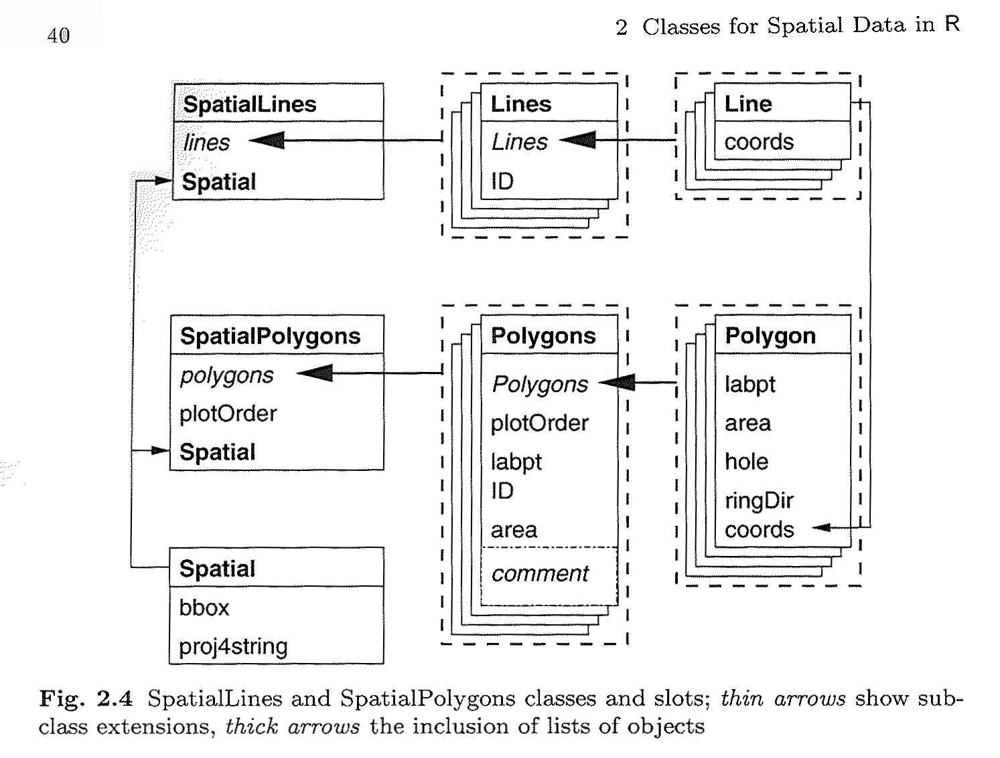

```{r setup, include=FALSE}
knitr::opts_chunk$set(echo = TRUE)
```

## Some GPS coordinates

We start from a `data.frame` object with 5 rows and 4 columns. The numeric vector lon and lat give the GPS coordinates of 5 points, in decimal degrees (WGS84) .

```{r}
library(sp)
lon <- c(3.86379, 3.86291, 3.86243, 3.86220, 3.86314)
lat <- c(43.63838, 43.63878, 43.63863, 43.63821, 43.63810)
name <- c("AA", "BB", "CC", "DD", "EE")
color <- c("green", "green", "green", "blue", "blue")
df <- data.frame(name, lon, lat, color)
```

## The SpatialPoints class

SpatialPoints class is a data structure to store points : only the "spatial" part, not the "attributes" part.
To build a SpatialPoints object, we just need :

- a 2-columns matrix (with XY coordinates, or "longitude latitude" if you prefer)
- if possible, a CRS object made of the **proj4 definition** of the coordinate reference system. We found the WGS84 on epsg.io website, from this URL : <http://epsg.io/4326>.

```{r}
matcoords <- as.matrix(df[,c("lon","lat")])
spts <- SpatialPoints(matcoords, proj4string = CRS("+proj=longlat +datum=WGS84 +no_defs"))
# the following proj4string definition with EPSG ID is equivalent to the explicit definition ...
spts <- SpatialPoints(matcoords, proj4string = CRS("+init=EPSG:4326"))
slotNames(spts)
```

## Distances between the points

The `spDists` function makes easy to measures distances between points, whether their coordinates are in meters or degrees. If the coordinates are in degrees, we will put the `longlat` parameter to **TRUE**, and the output will be in kilometers.
Let us measure the distance between all the points and themselves.

```{r}
matdist_meters <- spDists(spts, y=spts, longlat=T) * 1000
matdist_meters
```

We can also measure the distance between consecutive points (the segments).
```{r}
lsegments_meters <- spDists(spts, longlat=T, segments=T) * 1000
lsegments_meters
```

## Building a SpatialPointDataFrame from a data.frame with coordinates
It can be achieved with coordinates method with the name of X and Y columns.
```{r}
spts_df <- df
# turn a data.frame into a SpatialPointsDataFrame by providing X Y columns
coordinates(spts_df) <- c("lon","lat") 
# define the CRS (optional)
proj4string(spts_df) <- CRS("+init=EPSG:4326")
slotNames(spts_df)
```

## Saving the points under KML and Shapefile format
The maptools package provide functions to save `Spatial\*DataFrame` under .kml and .shp formats.
KML files can refer to image URLs as decoration for the points. See <https://sites.google.com/site/gmapsdevelopment/> to explore various icons.

```{r}
library(maptools)
# omit the extension to writer some_points.shp ...
writePointsShape(spts_df,"some_points")
# let us create 3 green markers and 2 blue markers
url_color_markers <- paste0("http://maps.google.com/mapfiles/ms/micons/",spts_df$color,".png")
kmlPoints(spts_df,kmlfile="points_TE.kml",name=spts_df$name, icon=url_color_markers)
```

## Join the dots ! Creating SpatialLines and SpatialLinesDataFrame objects from scratch
The following model from ASDAR book (<http://www.asdar-book.org/>), p. 40 shows us the composition of SpatialPolygons and SpatialLines.



A **SpatialLines** object can be made from a **list of Lines** objects.
A **Lines** object is a **list of Line** objects .
A **Line object** is made of a **matrix of coordinates**, just as a set of ordered points.

**Lines** in R is like a *Polyline* feature in a Shapefile, or a *MULTILINESTRING* feature in WKT notation : <https://en.wikipedia.org/wiki/Well-known_text#Geometric_objects>)

```{r}
# build 2 Lines object with ID slot = L1 and L2
matcoords1 <- as.matrix(df[,c("lon","lat")])
matcoords2 <- cbind(runif(5, -0.001, 0.001) + 3.8676, runif(5, -0.001, 0.001) + 43.6423)
line_1 <- Line(matcoords1)
line_2 <- Line(matcoords2)
lines_1 <- Lines(list(line_1), "L1")
lines_2 <- Lines(list(line_2), "L2")
splines <- SpatialLines(list(lines_1, lines_2))
str(splines)
```

A **SpatialLinesDataFrame** object is the combination between a **SpatialLines** object and a **data.frame**.
Use the **ID slot** from the SpatialLines object and the **row names** from the data.frame to make them match.

```{r}
# build a data.frame object with 2 columns and ID as the rows names.
NAME=c("LINE1", "RANDOM2")
LENGTH_M = SpatialLinesLengths(splines, longlat=T) * 1000
df_demo <- data.frame(NAME, LENGTH_M)
row.names(df_demo) <- c("L1","L2")
splines_df <- SpatialLinesDataFrame(splines, df_demo)
## save the SpatialLinesDataFrame as a shapefile
writeLinesShape(splines_df, fn="some_lines")
```

## Coordinates transformation
Transforming coordinates from a system to another require the `rgdal` package. `rgdal` provides drivers for an important number of raster and vector formats (see all the formats on the website of the GDAL library and its OGR sub-library). It also provides the **spTransform** function that makes possible to transform coordinates. 
It is possible to apply the **spTransform** on any `Spatial*` or `Spatial*DataFrame` class. The system coordinates of the input object must have been defined with **proj4string** parameter. When calling **spTransform** we only have to specify output coordinate system.

```{r}
# check input CRS
proj4string(spts_df)
# transformation to RGF93 / Lambert93
spts_df_l93 <- spTransform(spts_df, CRS("+init=EPSG:2154"))
spts_df_l93@coords
```

